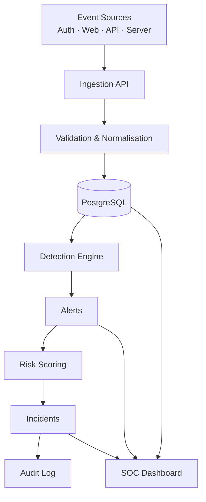

# Securis

**Securis** is a full-stack **Security Information and Event Management (SIEM)** platform. It collects security events, validates and normalises them, stores them in PostgreSQL, analyses them with a rule-based detection engine, raises alerts, calculates deterministic risk scores, and supports incident investigation and response — all with a complete audit trail.

> **Status: Phase 14 of 22 — Attack Simulation Lab.** All core SIEM functionality is in place: ingestion, event exploration, the detection engine and its rules, risk scoring, alert triage, incident management, threat intelligence, rule management, the operations dashboard and the attack simulation lab. The remaining phases add audit-log UI, user management, global search, hardening, tests, Docker and documentation.

---

## What is SIEM?

**SIEM** stands for *Security Information and Event Management*. A SIEM platform combines two capabilities:

- **SIM (Security Information Management)** — long-term collection, storage and analysis of log/event data.
- **SEM (Security Event Management)** — real-time monitoring, correlation and alerting on security-relevant events.

In practice a SIEM is the central nervous system of a Security Operations Center (SOC): it ingests logs from many sources, finds the signals in the noise, and gives analysts the context they need to investigate and respond.

## Problem statement

Security telemetry is scattered. Authentication systems, web applications, APIs and servers each emit logs in their own format, and no single system correlates them. As a result, attacks such as brute force, credential stuffing, account takeover and privilege escalation go unnoticed until it is too late.

Securis addresses this by providing a single pipeline:

```
Collect → Validate → Normalise → Store → Analyse → Detect → Alert → Score → Investigate → Resolve → Audit
```

## Features (by phase)

| Phase | Area | Status |
| --- | --- | --- |
| 1 | Project foundation, SOC UI shell, routing | ✅ Complete |
| 2 | Database architecture (Prisma + PostgreSQL) | ✅ Complete |
| 3 | Authentication & RBAC | ✅ Complete |
| 4 | Log ingestion pipeline | ✅ Complete |
| 5 | Event management | ✅ Complete |
| 6 | Detection engine | ✅ Complete |
| 7 | Security detection rules (7 rules) | ✅ Complete |
| 8 | Risk scoring | ✅ Complete |
| 9 | Alert management | ✅ Complete |
| 10 | Incident management | ✅ Complete |
| 11 | Threat intelligence | ✅ Complete |
| 12 | Detection rule management | ✅ Complete |
| 13 | Security operations dashboard | ✅ Complete |
| 14 | Attack simulation lab | ✅ Complete |
| 15 | Audit logging | ⏳ Planned |
| 16 | User management | ⏳ Planned |
| 17 | Global search | ⏳ Planned |
| 18 | Security hardening | ⏳ Planned |
| 19 | Automated testing | ⏳ Planned |
| 20 | Docker & deployment | ⏳ Planned |
| 21 | Documentation | ⏳ Planned |
| 22 | Final quality check | ⏳ Planned |

## Tech stack

| Layer | Technology |
| --- | --- |
| Frontend | Next.js (App Router), React, TypeScript |
| Styling | Tailwind CSS v4, shadcn/ui, Recharts |
| Backend | Next.js server components, route handlers, TypeScript |
| Database | PostgreSQL, Prisma ORM |
| Auth | Custom Argon2id hashing + database-backed sessions (Phase 3) |
| Infra | Docker, Docker Compose, Git, GitHub Actions |

## Architecture



### Code organisation

```
app/          Routes and API handlers (thin layer, no business logic)
components/   UI: ui/ (shadcn), layout/ (shell), shared/ (reusable states)
lib/          Client-side helpers, navigation model, validation schemas
server/       Business logic: services, detection engine, ingestion, threat intel
database/     Prisma schema, migrations and seed data
auth/         Session handling and RBAC helpers (Phase 3)
security/     Headers, CSRF, rate limiting, password policy (Phase 3+)
types/        Shared domain types
utils/        Pure utility functions
tests/        Automated test suites (Phase 19)
```

## Database architecture

The schema lives in [`database/prisma/schema.prisma`](./database/prisma/schema.prisma) and models the full SIEM pipeline.

| Model | Role in the pipeline |
| --- | --- |
| `SecurityEvent` | Normalised telemetry — the core record every collector produces |
| `DetectionRule` | Database-stored rules the detection engine evaluates (rules are data, not code) |
| `Alert` | A detection that fired, linked to its rule and related events |
| `Incident` | A coordinated investigation built from one or more alerts |
| `ThreatIndicator` | Local threat intelligence (IP / domain / hash / URL) |
| `AuditLog` | Immutable record of every privileged action |
| `User` | Analyst / administrator accounts with RBAC roles |
| `LoginSession` | Database-backed sessions (only a token hash is stored) |

Key relationships:

```
SecurityEvent >──< Alert >──< Incident
DetectionRule ──< Alert
User ──< LoginSession · Alert(assignee) · Incident(assignee) · DetectionRule(creator) · AuditLog(actor)
Alert ──< AlertNote >── User        Incident ──< IncidentNote >── User
```

Indexes are chosen for the query patterns of later phases: event filtering
(`timestamp`, `sourceIp`, `username`, `eventType`, `severity` plus time-series
composites), the alert queue (`status`, `severity`, `(status,severity)`), and
the audit trail (`action`, `actorId`, `(targetType,targetId)`).

### Seed data

`npm run db:seed` creates a deterministic, realistic dataset: 5 users, 7
detection rules, 8 threat indicators, **757 security events**, 7 alerts, 3
incidents, login sessions and 31 audit-log entries. The events include seven
scripted attack scenarios (brute force, account takeover, privilege escalation,
API abuse, unauthorized access, sensitive-resource access and a suspicious login
pattern) that the Phase 6/7 detection engine genuinely re-detects.

Development credentials created by the seed (never used in production):

| Role | Email | Password |
| --- | --- | --- |
| ADMIN | `admin@securis.local` | `SecurisAdmin#2026` |
| SECURITY_ANALYST | `analyst@securis.local` | `SecurisAnalyst#2026` |
| VIEWER | `viewer@securis.local` | `SecurisViewer#2026` |

Passwords are hashed with **Argon2id** before storage.

## Authentication & RBAC

Securis uses a custom, database-backed session system (no third-party auth provider) so the security engineering is explicit and auditable.

**Authentication**

- Passwords are hashed with **Argon2id** (OWASP baseline parameters) and verified with the same module used by the seed — plaintext is never stored or logged.
- On login the server creates an opaque 256-bit token, stores only its **SHA-256 hash** in `LoginSession`, and returns the token in an **HttpOnly, SameSite=Lax** cookie (`Secure` automatically for HTTPS deployments).
- Sessions have an absolute expiry, are refreshed lazily (`lastSeenAt`, throttled) and can be revoked individually. Expired sessions are deleted and recorded as `SESSION_EXPIRED`.
- **Rate limiting** is applied per source IP *and* per account using a sliding window (default 5 attempts / 5 minutes).
- **Account-enumeration resistance:** unknown email, wrong password and disabled account all return the same generic message, and a dummy hash is verified when the account does not exist so response timing does not reveal whether an email is registered.
- A **disabled account loses access immediately**, even with a valid session.

**Role-based access control**

| Role | Capabilities |
| --- | --- |
| `ADMIN` | Manage users, detection rules, alerts, incidents and audit logs; view all events |
| `SECURITY_ANALYST` | View events, investigate/update alerts, manage incidents, maintain threat intel, run simulations |
| `VIEWER` | Read-only access to the console |

Authorization is enforced **server-side** in two places: the authenticated `(soc)` layout checks the route's required permission before streaming (returning a real HTTP 307 on denial), and each protected page repeats the check with `requirePermission` as defence in depth. Hiding a navigation item is a convenience only — it is never the security boundary.

**Audit trail** — every authentication event is recorded: `LOGIN_SUCCESS`, `LOGIN_FAILED`, `LOGOUT`, `SESSION_CREATED`, `SESSION_EXPIRED` and `SESSION_REVOKED`.

**API endpoints**

| Method | Route | Purpose |
| --- | --- | --- |
| `POST` | `/api/auth/login` | Authenticate and issue a session cookie |
| `POST` | `/api/auth/logout` | Revoke the session and clear the cookie |
| `GET` | `/api/auth/session` | Return the current user (401 when unauthenticated) |

## Log ingestion

Security events enter Securis through a single normalising pipeline:

```
Raw event → Zod validation → parser → normaliser → semantic validation → SecurityEvent → PostgreSQL
```

The endpoint accepts events from **web applications, authentication systems, APIs, servers, databases, networks, infrastructure and applications**. Each `sourceType` has a parser that reconciles the producer's vocabulary (`user` / `principal` / `client_ip` / `status_code`, …) onto the canonical model, so collectors can forward their native payload in a `raw` field without pre-formatting it.

**Authentication** — `POST /api/ingest` accepts either an `X-Ingest-Key` header (compared in constant time) or an authenticated session whose role holds `events:ingest`. Rate limiting is applied per source IP.

**Never trusting the client** — every field is validated: unknown keys are stripped, `sourceType`/`severity` are mapped to the canonical enums, IPs are validated, timestamps are checked for plausibility, messages and metadata are size-capped, and per-event rejections are reported by index so a collector can retry only what failed.

```bash
curl -X POST http://localhost:3000/api/ingest \
  -H "Content-Type: application/json" \
  -H "X-Ingest-Key: $INGEST_API_KEY" \
  -d '{
    "timestamp": "2026-09-22T10:42:21Z",
    "source": "authentication-service",
    "sourceType": "AUTH",
    "eventType": "LOGIN_FAILED",
    "severity": "MEDIUM",
    "username": "admin",
    "sourceIp": "192.168.1.50",
    "message": "Failed authentication attempt"
  }'
```

Response (`202 Accepted`, or `400` when every event in the batch was rejected):

```json
{
  "ok": true,
  "data": {
    "received": 1,
    "accepted": 1,
    "rejected": 0,
    "eventIds": ["..."],
    "errors": []
  }
}
```

A batch of up to 500 events may be sent as a JSON array. Collectors may also forward a native payload:

```json
{
  "source": "authentication-service",
  "sourceType": "AUTH",
  "raw": { "user": "Bob", "ip": "10.0.0.5", "outcome": "failed" }
}
```

This is normalised to `LOGIN_FAILED` with severity `MEDIUM`, username `bob`, source IP `10.0.0.5`, and the original payload preserved under `metadata.raw`.

## Event management

`/events` is a server-rendered explorer. All filtering, sorting and pagination are executed by the database — the browser only ever receives the current page of rows, never the full event set.

- **Filters:** free-text search (message, username, source, event type, resource, IPs), severity, source type, source, event type, status, username, source IP and an inclusive date range.
- **Sorting:** click any of the Timestamp / Severity / Event type / Source column headers to toggle ascending/descending.
- **Pagination:** page size 25/50/100 with first/last/neighbour page links.
- **URL-driven state:** the whole view lives in the query string, so every filter combination is shareable and works without client-side JavaScript.
- **Detail view** (`/events/[id]`): timestamp, source, event type, severity, username, source/destination IP, user agent, resource, action, status, message, raw metadata, and the alerts and incidents the event contributed to.

The same data is available programmatically via `GET /api/events` and `GET /api/events/[id]` (requires the `events:read` permission).

## Detection engine

The detection engine evaluates **database-stored rules** against stored events. Rules are data, not code, so they can be tuned, enabled and disabled without a deployment.

Each rule has a `ruleType` that selects an evaluator, and a JSON `condition` document validated against a schema for that type:

| Rule type | Evaluator behaviour | Used by |
| --- | --- | --- |
| `EVENT_MATCH` | Fires when events match the filters, grouped by user/IP | Privilege escalation, sensitive-resource access |
| `THRESHOLD` | Counts matching events per group in a window; fires at the threshold | Brute force, unauthorized access |
| `TIME_WINDOW` | As threshold, tuned for high-rate windows | API abuse |
| `IP_BASED` | Threshold grouped by source IP | (available for custom rules) |
| `CORRELATION` | Relates failures followed by a success for the same group, optionally from a new IP | Account takeover |
| `USER_BASED` | Behavioural signals: new IP, new device, off-hours, failures before success | Suspicious login pattern |

**Idempotent by design.** Every finding carries a dedupe key of `ruleCode:groupValue:windowBucket`. Re-running detection over the same events updates the existing alert (refreshing `lastSeen`, risk score and related events) instead of creating duplicates — so detection runs safely on every ingestion.

**Deterministic risk scoring.** Every finding is scored 0–100 by a documented, reproducible model — no randomness — with an itemised factor breakdown that the UI renders so an analyst can see *why* an alert scored what it did. See [Risk scoring](#risk-scoring).

**Entry points**

| Trigger | Path |
| --- | --- |
| After events are ingested | `server/ingestion/pipeline.ts` |
| Manual / backfill scan | `POST /api/detection/scan` (requires `detection:run`) |
| Attack simulation lab | Phase 14 |

## Risk scoring

Every detection is scored **0–100** by a deterministic model: identical inputs always produce the same score, so detections are reproducible and testable. Each contribution is recorded as a factor and shown in the UI.

| Factor | Contribution |
| --- | --- |
| **Base severity** | `SEVERITY_WEIGHTS[severity] × 6` → INFO 6 · LOW 12 · MEDIUM 30 · HIGH 48 · CRITICAL 60 |
| **Frequency** | `min(20, round(eventCount / threshold × 10))` — only for rules with a real threshold |
| **Detection rule** | CORRELATION +8 · USER_BASED +6 · THRESHOLD +4 · IP_BASED/TIME_WINDOW +3 · EVENT_MATCH +2 |
| **Target account** | +3 when an account is targeted, **+9 more** if it is a privileged account (`admin`, `root`, …) |
| **Source IP** | +5 when recorded, +5 more when publicly routable |
| **Threat intelligence** | `min(20, round(confidence / 5))` when the source IP matches a local indicator |
| **Repeated behaviour** | `min(15, priorOccurrences × 3)` — how often this rule+group fired in earlier windows |

The total is clamped to 0–100 and mapped to a band:

| Score | Band |
| --- | --- |
| 0–25 | Low |
| 26–50 | Moderate |
| 51–75 | High |
| 76–100 | Critical |

Threat-intelligence matches come from the local indicator database through a dedicated service layer (`server/threat-intel/matcher.ts`), so external feeds can be added later without touching detection code. IP classification is **private vs public routing only** — Securis makes no geolocation claims.

Example (brute force against `admin` from a known malicious IP):

```
+48  Base severity HIGH
+12  Frequency 6 events vs threshold 5
 +4  Detection rule type THRESHOLD
 +3  Target account identified (admin)
 +9  Privileged account involvement (admin)
 +5  Source IP recorded
 +5  Source IP is publicly routable
+17  Threat intelligence match (Credential Attack) · confidence 85
= 103 → clamped to 100 (Critical)
```

The score and its factor breakdown are stored on the alert (`riskScore`, `riskFactors`) and rendered wherever alerts appear.

## Alert management

`/alerts` is the analyst triage queue. Like the event explorer it is server-rendered and fully URL-driven.

- **Filters:** free-text search (title, description, IP, user), severity, status, detection rule, source IP, target user, assignment (assigned / unassigned) and a created-date range.
- **Sorting:** severity, risk score, status, first seen, last seen and created.
- **Pagination:** page size 25/50/100.
- **Detail view** (`/alerts/[id]`): severity, status, risk score with its full factor breakdown, detection rule, source/target, first/last seen, assignment, related events, related incidents, notes, and a merged **investigation timeline**.

Analysts can:

| Action | Endpoint | Permission |
| --- | --- | --- |
| Change status (`NEW`, `INVESTIGATING`, `RESOLVED`, `FALSE_POSITIVE`) | `PATCH /api/alerts/[id]` | `alerts:write` |
| Assign / unassign an analyst | `PATCH /api/alerts/[id]` | `alerts:write` |
| Add a note | `POST /api/alerts/[id]/notes` | `alerts:write` |
| Mark false positive / resolve | quick actions (status shortcuts) | `alerts:write` |

`RESOLVED` and `FALSE_POSITIVE` stamp `resolvedAt`; any other status clears it. Every mutation writes an audit entry (`ALERT_STATUS_CHANGED`, `ALERT_ASSIGNED`, `ALERT_NOTE_ADDED`). The permission is enforced on the server — the actions panel is only hidden for read-only roles, and the API returns `403` regardless of the UI.

## Incident management

An incident is a coordinated investigation built from one or more alerts. `/incidents` is the response board.

- **Create** from alerts — either from the incident board (pick from the highest-risk open alerts) or directly from an alert's detail page ("Create incident"). The incident inherits the **highest severity** of the selected alerts and links the **union of their events**, so its timeline is complete from the start.
- **Reference** is generated sequentially per year: `INC-2026-001`, `INC-2026-002`, …
- **Filters:** search (reference/title/description), severity, status, assigned analyst, assigned/unassigned and a created-date range.
- **Sorting:** reference, severity, status, created and updated. Pagination 25/50/100.
- **Detail view** (`/incidents/[id]`): reference, severity, status, assignment, created/updated/resolved, related alerts, related events, notes, the resolution and the merged investigation timeline.

| Action | Endpoint | Permission |
| --- | --- | --- |
| Create from alerts | `POST /api/incidents` | `incidents:write` |
| Change status (`OPEN`, `INVESTIGATING`, `CONTAINED`, `RESOLVED`, `CLOSED`) | `PATCH /api/incidents/[id]` | `incidents:write` |
| Assign / unassign an analyst | `PATCH /api/incidents/[id]` | `incidents:write` |
| Record / edit the resolution | `PATCH /api/incidents/[id]` | `incidents:write` |
| Add a note | `POST /api/incidents/[id]/notes` | `incidents:write` |

`RESOLVED` and `CLOSED` stamp `resolvedAt`. Every change is audited (`INCIDENT_CREATED`, `INCIDENT_UPDATED`, `INCIDENT_RESOLVED`, `INCIDENT_CLOSED`, `INCIDENT_NOTE_ADDED`).

## Threat intelligence

`/threat-intelligence` is the local indicator database — the source of the threat-intelligence factor in risk scoring. Active indicators are consulted by the risk engine; when an event's source IP matches one, the alert's risk score is raised.

Indicators have a **type** (`IP`, `DOMAIN`, `HASH`, `URL`), **value**, **threat type**, **confidence** (0–100), **source**, **description**, first/last-seen timestamps and an **active** flag.

- **Search & filter:** free text (value, threat type, source, description), type, threat type, source, minimum confidence and active/retired status.
- **Add / edit** indicators with format validation per type (IPv4/IPv6, domain, MD5/SHA-1/SHA-256 hex, http(s) URL).
- **Retire** an indicator (keeps it for history but excludes it from risk scoring) or **delete** it.
- Duplicate indicators (same type + value) are rejected with `409`.

| Action | Endpoint | Permission |
| --- | --- | --- |
| List / search | `GET /api/threat-intelligence` | `threat-intel:read` |
| Add | `POST /api/threat-intelligence` | `threat-intel:write` |
| Update / retire | `PATCH /api/threat-intelligence/[id]` | `threat-intel:write` |
| Delete | `DELETE /api/threat-intelligence/[id]` | `threat-intel:write` |

**External integrations stay isolated.** All indicator access goes through `server/threat-intel/` (`matcher.ts` for lookups, `service.ts` for CRUD). A real feed integration would slot in behind that boundary; no API keys or feed URLs exist anywhere in the codebase, and detection code never talks to a provider directly. Audit actions: `THREAT_INDICATOR_ADDED`, `THREAT_INDICATOR_UPDATED`, `THREAT_INDICATOR_DELETED`.

## Detection rules

Seven rules ship with Securis. They are stored in the database and evaluated by the engine — nothing is hard-coded in the UI.

| Code | Rule | Type | Severity | Condition | Threshold / window |
| --- | --- | --- | --- | --- | --- |
| `BRUTE_FORCE_001` | Brute Force Detection | `THRESHOLD` | HIGH | `LOGIN_FAILED` grouped by source IP | ≥ 5 in 300 s |
| `ACCOUNT_TAKEOVER_001` | Possible Account Takeover | `CORRELATION` | CRITICAL | failures → success for a username from a **new IP** | ≥ 3 failures in 600 s |
| `PRIVILEGE_ESCALATION_001` | Suspicious Privilege Escalation | `EVENT_MATCH` | HIGH | `ADMIN_PRIVILEGE_GRANTED`, `USER_ROLE_CHANGED` | — |
| `API_ABUSE_001` | Abnormal API Activity | `TIME_WINDOW` | MEDIUM | `API_REQUEST` grouped by source IP | ≥ 100 in 60 s |
| `UNAUTHORIZED_ACCESS_001` | Possible Unauthorized Access Attempt | `THRESHOLD` | MEDIUM | `401`/`403` grouped by source IP | ≥ 10 in 300 s |
| `SENSITIVE_RESOURCE_ACCESS_001` | Sensitive Resource Access | `EVENT_MATCH` | HIGH | web/API access to `/admin`, `/users`, `/config`, `/database`, `.env` | — |
| `SUSPICIOUS_LOGIN_PATTERN_001` | Suspicious Login Pattern | `USER_BASED` | MEDIUM | new IP + new device + off-hours + prior failures | ≥ 3 of 4 signals in 900 s |

Each rule produces a clearly titled alert (`Possible Brute Force Attack`, `Possible Account Takeover`, `Suspicious Privilege Escalation`, `Abnormal API Activity`, `Possible Unauthorized Access Attempt`, `Sensitive Resource Access`, `Suspicious Login Pattern`) linked to the events that triggered it.

**Rules can overlap by design.** The same activity may legitimately satisfy more than one rule (for example, a login that is both a takeover and a suspicious-login pattern). This is defence in depth, not duplication — each alert carries the rule that produced it.

The seeded database is generated by **actually running the engine**: `npm run db:seed` creates the attack scenarios, invokes detection, and then layers analyst triage (assignment, status, resolution) on top of the resulting alerts.

## Detection rule management

`/detection-rules` is the administrator-only management surface for the rules the engine evaluates. Because rules are **data stored in the database**, changes take effect on the next detection run with no deployment.

- **Table:** rule code, name, type, severity, threshold, time window, enabled status, alerts produced and last-updated, with search, severity/type/status filters, sorting and pagination.
- **Detail view** (`/detection-rules/[id]`): the full metadata, the **raw condition document** (so an administrator can see exactly what the engine evaluates) and the most recent alerts the rule produced.
- **Create / edit** with a type-aware condition form: the fields change with the rule type (`EVENT_MATCH`, `THRESHOLD`, `TIME_WINDOW`, `IP_BASED`, `CORRELATION`, `USER_BASED`), and the server validates the condition against the same schema the engine uses — a rule can never be stored in a shape the engine cannot evaluate.
- **Enable / disable** — disabled rules are skipped by the engine (verified: a scan after disabling a rule produced no alerts for it).
- **Delete** — the rule stops being evaluated; alerts it already produced are kept (their rule reference is cleared).

| Action | Endpoint | Permission |
| --- | --- | --- |
| List | `GET /api/detection-rules` | `rules:read` |
| Create | `POST /api/detection-rules` | `rules:write` |
| Detail | `GET /api/detection-rules/[id]` | `rules:read` |
| Update / enable / disable | `PATCH /api/detection-rules/[id]` | `rules:write` |
| Delete | `DELETE /api/detection-rules/[id]` | `rules:write` |

Duplicate rule codes are rejected with `409`. Audit actions: `RULE_CREATED`, `RULE_UPDATED`, `RULE_ENABLED`, `RULE_DISABLED`, `RULE_DELETED` (a change that only flips `enabled` is recorded as enabled/disabled rather than a generic update).

## Security operations dashboard

`/dashboard` is the SOC overview. **Every number is aggregated from the database at request time — there are no hard-coded statistics.**

Headline metrics: total events, events today, critical alerts (open), high alerts (open), open incidents, active users and suspicious IPs (distinct source IPs seen in alerts).

Charts (Recharts):

| Chart | Source |
| --- | --- |
| Events over time | daily event counts, last 14 days |
| Alerts over time | daily alert counts, last 14 days |
| Events by severity | `groupBy severity` |
| Events by source | `groupBy source` |
| Events by event type | `groupBy eventType` |
| Top source IPs | `groupBy sourceIp` |
| Top targeted users | `groupBy username` |
| Authentication outcomes | successful vs failed logins (donut) |

A **Recent alerts** table shows the latest detections with severity, risk score, rule, source IP, target user and status. All aggregations live in `server/services/dashboard-service.ts`; the charts are thin client components that receive the already-aggregated data.

## Attack simulation lab

`/simulation` generates **controlled local attack traffic** that flows through the real ingestion and detection pipeline — nothing is mocked, and nothing leaves the application.

| Scenario | Generates | Expected detection |
| --- | --- | --- |
| Simulate Brute Force | 6 failed logins from one IP | `BRUTE_FORCE_001` |
| Simulate Account Takeover | 4 failures + a success from a new IP | `ACCOUNT_TAKEOVER_001` |
| Simulate Privilege Escalation | role change + privilege grant | `PRIVILEGE_ESCALATION_001` |
| Simulate API Abuse | 105 API requests in under a minute | `API_ABUSE_001` |
| Simulate Unauthorized Access | 12 × 401/403 from one IP | `UNAUTHORIZED_ACCESS_001` |
| Generate Normal Traffic | ordinary logins, views, API calls, health checks | none (baseline) |

Each run posts to `POST /api/simulation` (`simulation:run`), which builds the events, calls the **same `ingestEvents` pipeline** used by the ingestion API, and returns the outcome (events accepted, alerts created/updated, findings). The panel then links directly to the alerts that were raised.

Simulated events are tagged `metadata.simulation = true` and use **RFC 5737 documentation addresses** (`198.51.100.0/24`), so they are always distinguishable from real telemetry. Every run is recorded as a `SIMULATION_RUN` audit entry. The lab only ever operates on Securis' own test data.

## Getting started

### Prerequisites

- Node.js 20+ (developed on Node 24)
- npm 10+
- PostgreSQL — either a local **Prisma Postgres** instance (`npx prisma dev`, no Docker required) or **Neon** in the cloud
- Docker (optional, for the containerised workflow)

### 1. Install dependencies

```bash
npm install
```

### 2. Configure the environment

```bash
cp .env.example .env      # PowerShell: Copy-Item .env.example .env
```

Fill in `DATABASE_URL`, `SHADOW_DATABASE_URL`, `SESSION_SECRET` and `INGEST_API_KEY`. **Never commit `.env`** — only `.env.example` is tracked.

To generate a session secret:

```bash
node -e "console.log(require('crypto').randomBytes(48).toString('base64url'))"
```

### 3. Start the database (development, no Docker)

```bash
npx prisma dev --detach
```

Copy the connection strings it prints into `.env`. See the [Prisma local Postgres docs](https://www.prisma.io/docs/local-development/postgres) for details.

### 4. Apply migrations and seed

```bash
npm run db:migrate
npm run db:seed
npm run db:verify   # optional: prints the seeded data and attack scenarios
```

### 5. Run the app

```bash
npm run dev
```

Open <http://localhost:3000>.

### Useful scripts

| Command | Purpose |
| --- | --- |
| `npm run dev` | Start the development server |
| `npm run build` | Production build |
| `npm run lint` | ESLint |
| `npm run typecheck` | TypeScript, no emit |
| `npm run db:migrate` | Apply Prisma migrations |
| `npm run db:seed` | Seed the database with realistic data |
| `npm run db:verify` | Run real queries to verify the seeded data |
| `npm run db:studio` | Open Prisma Studio |

## Docker

```bash
cp .env.example .env   # then set SESSION_SECRET and INGEST_API_KEY
docker compose up --build
```

## Environment variables

See [`.env.example`](./.env.example) for the full, documented list.

## Security

Securis treats security as a feature, not an afterthought. Implemented so far: baseline HTTP security headers and a dark-only UI with no client-side secrets. Phase 18 performs a full hardening review (Argon2id password hashing, database-backed sessions, server-side RBAC, input validation, rate limiting, CSRF, XSS/SQL-injection protections, safe error handling).

## Roadmap

The project is built strictly phase by phase. See the feature table above. Each phase must lint, build and pass its checks before the next begins.

## License

This project is provided for educational and portfolio purposes.
