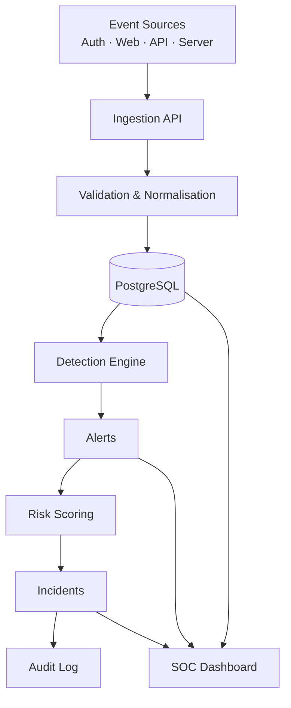

# Securis

**Securis** is a full-stack **Security Information and Event Management (SIEM)** platform. It collects security events, validates and normalises them, stores them in PostgreSQL, analyses them with a rule-based detection engine, raises alerts, calculates deterministic risk scores, and supports incident investigation and response — all with a complete audit trail.

> **Status: Phase 2 of 22 — Database Architecture.** The application shell, routing, theme, tooling and the complete PostgreSQL data model (migrations + realistic seed) are in place. Security functionality is added phase by phase. This README is updated at the end of every phase.

---

## What is SIEM?

**SIEM** stands for *Security Information and Event Management*. A SIEM platform combines two capabilities:

- **SIM (Security Information Management)** — long-term collection, storage and analysis of log/event data.
- **SEM (Security Event Management)** — real-time monitoring, correlation and alerting on security-relevant events.

In practice a SIEM is the central nervous system of a Security Operations Center (SOC): it ingests logs from many sources, finds the signals in the noise, and gives analysts the context they need to investigate and respond.

## Problem statement

Security telemetry is scattered. Authentication systems, web applications, APIs and servers each emit logs in their own format, and no single system correlates them. As a result, attacks such as brute force, credential stuffing, account takeover and privilege escalation go unnoticed until it is too late.

Securis addresses this by providing a single pipeline:

```
Collect → Validate → Normalise → Store → Analyse → Detect → Alert → Score → Investigate → Resolve → Audit
```

## Features (by phase)

| Phase | Area | Status |
| --- | --- | --- |
| 1 | Project foundation, SOC UI shell, routing | ✅ Complete |
| 2 | Database architecture (Prisma + PostgreSQL) | ✅ Complete |
| 3 | Authentication & RBAC | ⏳ Planned |
| 4 | Log ingestion pipeline | ⏳ Planned |
| 5 | Event management | ⏳ Planned |
| 6 | Detection engine | ⏳ Planned |
| 7 | Security detection rules (7 rules) | ⏳ Planned |
| 8 | Risk scoring | ⏳ Planned |
| 9 | Alert management | ⏳ Planned |
| 10 | Incident management | ⏳ Planned |
| 11 | Threat intelligence | ⏳ Planned |
| 12 | Detection rule management | ⏳ Planned |
| 13 | Security operations dashboard | ⏳ Planned |
| 14 | Attack simulation lab | ⏳ Planned |
| 15 | Audit logging | ⏳ Planned |
| 16 | User management | ⏳ Planned |
| 17 | Global search | ⏳ Planned |
| 18 | Security hardening | ⏳ Planned |
| 19 | Automated testing | ⏳ Planned |
| 20 | Docker & deployment | ⏳ Planned |
| 21 | Documentation | ⏳ Planned |
| 22 | Final quality check | ⏳ Planned |

## Tech stack

| Layer | Technology |
| --- | --- |
| Frontend | Next.js (App Router), React, TypeScript |
| Styling | Tailwind CSS v4, shadcn/ui, Recharts |
| Backend | Next.js server components, route handlers, TypeScript |
| Database | PostgreSQL, Prisma ORM |
| Auth | Custom Argon2id hashing + database-backed sessions (Phase 3) |
| Infra | Docker, Docker Compose, Git, GitHub Actions |

## Architecture



### Code organisation

```
app/          Routes and API handlers (thin layer, no business logic)
components/   UI: ui/ (shadcn), layout/ (shell), shared/ (reusable states)
lib/          Client-side helpers, navigation model, validation schemas
server/       Business logic: services, detection engine, ingestion, threat intel
database/     Prisma schema, migrations and seed data
auth/         Session handling and RBAC helpers (Phase 3)
security/     Headers, CSRF, rate limiting, password policy (Phase 3+)
types/        Shared domain types
utils/        Pure utility functions
tests/        Automated test suites (Phase 19)
```

## Database architecture

The schema lives in [`database/prisma/schema.prisma`](./database/prisma/schema.prisma) and models the full SIEM pipeline.

| Model | Role in the pipeline |
| --- | --- |
| `SecurityEvent` | Normalised telemetry — the core record every collector produces |
| `DetectionRule` | Database-stored rules the detection engine evaluates (rules are data, not code) |
| `Alert` | A detection that fired, linked to its rule and related events |
| `Incident` | A coordinated investigation built from one or more alerts |
| `ThreatIndicator` | Local threat intelligence (IP / domain / hash / URL) |
| `AuditLog` | Immutable record of every privileged action |
| `User` | Analyst / administrator accounts with RBAC roles |
| `LoginSession` | Database-backed sessions (only a token hash is stored) |

Key relationships:

```
SecurityEvent >──< Alert >──< Incident
DetectionRule ──< Alert
User ──< LoginSession · Alert(assignee) · Incident(assignee) · DetectionRule(creator) · AuditLog(actor)
Alert ──< AlertNote >── User        Incident ──< IncidentNote >── User
```

Indexes are chosen for the query patterns of later phases: event filtering
(`timestamp`, `sourceIp`, `username`, `eventType`, `severity` plus time-series
composites), the alert queue (`status`, `severity`, `(status,severity)`), and
the audit trail (`action`, `actorId`, `(targetType,targetId)`).

### Seed data

`npm run db:seed` creates a deterministic, realistic dataset: 5 users, 7
detection rules, 8 threat indicators, **757 security events**, 7 alerts, 3
incidents, login sessions and 31 audit-log entries. The events include seven
scripted attack scenarios (brute force, account takeover, privilege escalation,
API abuse, unauthorized access, sensitive-resource access and a suspicious login
pattern) that the Phase 6/7 detection engine genuinely re-detects.

Development credentials created by the seed (never used in production):

| Role | Email | Password |
| --- | --- | --- |
| ADMIN | `admin@securis.local` | `SecurisAdmin#2026` |
| SECURITY_ANALYST | `analyst@securis.local` | `SecurisAnalyst#2026` |
| VIEWER | `viewer@securis.local` | `SecurisViewer#2026` |

Passwords are hashed with **Argon2id** before storage.

## Getting started

### Prerequisites

- Node.js 20+ (developed on Node 24)
- npm 10+
- PostgreSQL — either a local **Prisma Postgres** instance (`npx prisma dev`, no Docker required) or **Neon** in the cloud
- Docker (optional, for the containerised workflow)

### 1. Install dependencies

```bash
npm install
```

### 2. Configure the environment

```bash
cp .env.example .env      # PowerShell: Copy-Item .env.example .env
```

Fill in `DATABASE_URL`, `SHADOW_DATABASE_URL`, `SESSION_SECRET` and `INGEST_API_KEY`. **Never commit `.env`** — only `.env.example` is tracked.

To generate a session secret:

```bash
node -e "console.log(require('crypto').randomBytes(48).toString('base64url'))"
```

### 3. Start the database (development, no Docker)

```bash
npx prisma dev --detach
```

Copy the connection strings it prints into `.env`. See the [Prisma local Postgres docs](https://www.prisma.io/docs/local-development/postgres) for details.

### 4. Apply migrations and seed

```bash
npm run db:migrate
npm run db:seed
npm run db:verify   # optional: prints the seeded data and attack scenarios
```

### 5. Run the app

```bash
npm run dev
```

Open <http://localhost:3000>.

### Useful scripts

| Command | Purpose |
| --- | --- |
| `npm run dev` | Start the development server |
| `npm run build` | Production build |
| `npm run lint` | ESLint |
| `npm run typecheck` | TypeScript, no emit |
| `npm run db:migrate` | Apply Prisma migrations |
| `npm run db:seed` | Seed the database with realistic data |
| `npm run db:verify` | Run real queries to verify the seeded data |
| `npm run db:studio` | Open Prisma Studio |

## Docker

```bash
cp .env.example .env   # then set SESSION_SECRET and INGEST_API_KEY
docker compose up --build
```

## Environment variables

See [`.env.example`](./.env.example) for the full, documented list.

## Security

Securis treats security as a feature, not an afterthought. Implemented so far: baseline HTTP security headers and a dark-only UI with no client-side secrets. Phase 18 performs a full hardening review (Argon2id password hashing, database-backed sessions, server-side RBAC, input validation, rate limiting, CSRF, XSS/SQL-injection protections, safe error handling).

## Roadmap

The project is built strictly phase by phase. See the feature table above. Each phase must lint, build and pass its checks before the next begins.

## License

This project is provided for educational and portfolio purposes.
