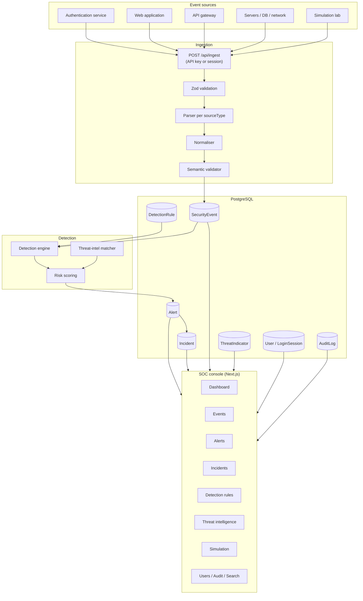
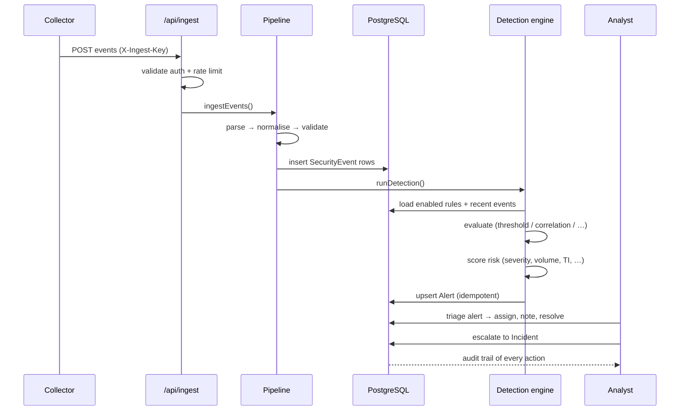
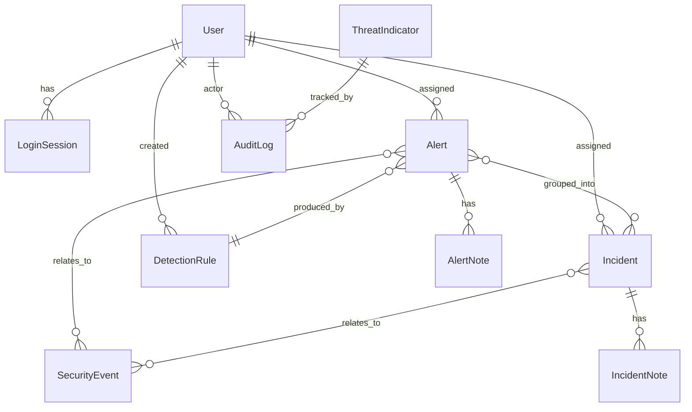

# Securis

**Securis** is a full-stack **Security Information and Event Management (SIEM)** platform. It collects security events from multiple sources, validates and normalises them, stores them in PostgreSQL, analyses them with a rule-based detection engine, raises scored alerts, and supports incident investigation and response — with a complete, immutable audit trail.

> **Status: Phase 21 of 22 — Documentation.** The platform is complete and documented; the final phase performs a closing quality audit across the whole project.

---

## Table of contents

1. [Project overview](#1-project-overview)
2. [What is SIEM?](#2-what-is-siem)
3. [Problem statement](#3-problem-statement)
4. [Features](#4-features)
5. [Architecture](#5-architecture)
6. [System workflow](#6-system-workflow)
7. [Tech stack](#7-tech-stack)
8. [Database architecture](#8-database-architecture)
9. [Detection engine](#9-detection-engine)
10. [Detection rules](#10-detection-rules)
11. [Risk scoring](#11-risk-scoring)
12. [Alert management](#12-alert-management)
13. [Incident management](#13-incident-management)
14. [Threat intelligence](#14-threat-intelligence)
15. [Attack simulation](#15-attack-simulation)
16. [Authentication](#16-authentication)
17. [RBAC](#17-rbac)
18. [Installation](#18-installation)
19. [Environment variables](#19-environment-variables)
20. [Docker setup](#20-docker-setup)
21. [Testing](#21-testing)
22. [Screenshots](#22-screenshots)
23. [Future improvements](#23-future-improvements)

---

## 1. Project overview

Securis is a working SIEM/SOC console built as a single Next.js application. It ingests security telemetry through a hardened API, normalises it into a canonical event model, stores it in PostgreSQL, and runs a database-driven detection engine over it. Detections become scored alerts, alerts become incidents, and every privileged action is written to an append-only audit trail.

It is designed to demonstrate **security engineering**, not just a dashboard: rules are data, scoring is deterministic and explainable, authorization is enforced server-side, and the whole pipeline is testable.

## 2. What is SIEM?

**SIEM** stands for *Security Information and Event Management*. It combines two capabilities:

- **SIM (Security Information Management)** — long-term collection, storage and analysis of log/event data.
- **SEM (Security Event Management)** — real-time monitoring, correlation and alerting on security-relevant events.

A SIEM is the central nervous system of a Security Operations Center (SOC): it ingests logs from many sources, finds the signal in the noise, and gives analysts the context to investigate and respond.

## 3. Problem statement

Security telemetry is scattered. Authentication systems, web applications, APIs, servers and databases each emit logs in their own format, and nothing correlates them. As a result, attacks such as brute force, credential stuffing, account takeover and privilege escalation go unnoticed until it is too late — and even when noticed, there is no consistent workflow to investigate and record the response.

Securis addresses this with a single, auditable pipeline:

```
Collect → Validate → Normalise → Store → Analyse → Detect → Alert → Score → Investigate → Resolve → Audit
```

## 4. Features

| Phase | Area | Status |
| --- | --- | --- |
| 1 | Project foundation, SOC UI shell, routing | ✅ |
| 2 | Database architecture (Prisma + PostgreSQL) | ✅ |
| 3 | Authentication & RBAC | ✅ |
| 4 | Log ingestion pipeline | ✅ |
| 5 | Event management | ✅ |
| 6 | Detection engine | ✅ |
| 7 | Security detection rules (7 rules) | ✅ |
| 8 | Risk scoring | ✅ |
| 9 | Alert management | ✅ |
| 10 | Incident management | ✅ |
| 11 | Threat intelligence | ✅ |
| 12 | Detection rule management | ✅ |
| 13 | Security operations dashboard | ✅ |
| 14 | Attack simulation lab | ✅ |
| 15 | Audit logging | ✅ |
| 16 | User management | ✅ |
| 17 | Global search | ✅ |
| 18 | Security hardening | ✅ |
| 19 | Automated testing | ✅ |
| 20 | Docker & deployment | ✅ |
| 21 | Documentation | ✅ |
| 22 | Final quality check | ⏳ |

Highlights:

- A protected ingestion API that normalises **8 source types** and never trusts client input.
- A **database-driven** detection engine with 6 rule strategies and 7 built-in rules.
- **Deterministic, explainable** risk scoring with an itemised factor breakdown.
- A full analyst workflow: alert triage, notes, assignment, incidents and resolutions.
- A local threat-intelligence database that feeds risk scoring.
- An attack simulation lab that drives the **real** pipeline.
- Server-enforced RBAC, an append-only audit trail and a 64-test automated suite.

## 5. Architecture


```mermaid
flowchart TD
    subgraph Sources["Event sources"]
        A1[Authentication service]
        A2[Web application]
        A3[API gateway]
        A4[Servers / DB / network]
        A5[Simulation lab]
    end

    subgraph Ingest["Ingestion"]
        B1["POST /api/ingest<br/>(API key or session)"]
        B2[Zod validation]
        B3[Parser per sourceType]
        B4[Normaliser]
        B5[Semantic validator]
    end

    subgraph Data["PostgreSQL"]
        D1[(SecurityEvent)]
        D2[(DetectionRule)]
        D3[(Alert)]
        D4[(Incident)]
        D5[(ThreatIndicator)]
        D6[(User / LoginSession)]
        D7[(AuditLog)]
    end

    subgraph Detect["Detection"]
        E1[Detection engine]
        E2[Risk scoring]
        E3[Threat-intel matcher]
    end

    subgraph UI["SOC console (Next.js)"]
        F1[Dashboard]
        F2[Events]
        F3[Alerts]
        F4[Incidents]
        F5[Detection rules]
        F6[Threat intelligence]
        F7[Simulation]
        F8[Users / Audit / Search]
    end

    A1 & A2 & A3 & A4 & A5 --> B1 --> B2 --> B3 --> B4 --> B5 --> D1
    D2 --> E1
    D1 --> E1 --> E2 --> D3
    E3 --> E2
    D3 --> D4
    D3 & D4 & D1 & D5 & D6 & D7 --> UI
```

Deeper diagrams (component, data-flow, ERD) live in [`docs/ARCHITECTURE.md`](./docs/ARCHITECTURE.md).

### Code organisation

```
app/          Routes and API handlers (thin layer, no business logic)
components/   UI: ui/ (shadcn), layout/, shared/, and one folder per domain
lib/          Client-safe helpers: query validation, URL builders
server/       Business logic: services, detection engine, ingestion, threat intel
database/     Prisma schema, migrations and seed
auth/         Session handling and RBAC helpers
security/     Password hashing and policy
types/        Shared domain types
utils/        Pure utilities (formatting, IP classification, errors)
tests/        Unit, integration and security suites
```

**Layering rule:** UI components never touch the database; route handlers stay thin and delegate to `server/services/**`; each domain owns its Prisma queries so indexes and projections live in one place.

## 6. System workflow


```mermaid
sequenceDiagram
    participant C as Collector
    participant API as /api/ingest
    participant P as Pipeline
    participant DB as PostgreSQL
    participant E as Detection engine
    participant A as Analyst

    C->>API: POST events (X-Ingest-Key)
    API->>API: validate auth + rate limit
    API->>P: ingestEvents()
    P->>P: parse → normalise → validate
    P->>DB: insert SecurityEvent rows
    P->>E: runDetection()
    E->>DB: load enabled rules + recent events
    E->>E: evaluate (threshold / correlation / …)
    E->>E: score risk (severity, volume, TI, …)
    E->>DB: upsert Alert (idempotent)
    A->>DB: triage alert → assign, note, resolve
    A->>DB: escalate to Incident
    DB-->>A: audit trail of every action
```

## 7. Tech stack

| Layer | Technology |
| --- | --- |
| Frontend | Next.js 16 (App Router), React 19, TypeScript (strict) |
| Styling | Tailwind CSS v4, shadcn/ui, Recharts |
| Backend | Next.js server components + route handlers, TypeScript |
| Database | PostgreSQL 16, Prisma ORM |
| Auth | Argon2id (`@node-rs/argon2`), database-backed sessions |
| Validation | Zod |
| Testing | Vitest |
| Infra | Docker, Docker Compose, Git, GitHub Actions-ready |

No Python is used; the entire platform is TypeScript, which keeps the detection and ingestion logic in one runtime and one test setup.

## 8. Database architecture

The schema lives in [`database/prisma/schema.prisma`](./database/prisma/schema.prisma).

| Model | Role |
| --- | --- |
| `SecurityEvent` | Normalised telemetry — the core record |
| `DetectionRule` | Database-stored rules the engine evaluates |
| `Alert` | A detection that fired, linked to its rule and events |
| `Incident` | A coordinated investigation built from alerts |
| `ThreatIndicator` | Local threat intelligence (IP / domain / hash / URL) |
| `AuditLog` | Append-only record of privileged actions |
| `User` | Analyst / administrator accounts with RBAC roles |
| `LoginSession` | Database-backed sessions (token hash only) |


```mermaid
erDiagram
    User ||--o{ LoginSession : has
    User ||--o{ Alert : assigned
    User ||--o{ Incident : assigned
    User ||--o{ DetectionRule : created
    User ||--o{ AuditLog : actor
    Alert }o--|| DetectionRule : produced_by
    Alert }o--o{ SecurityEvent : relates_to
    Alert }o--o{ Incident : grouped_into
    Incident }o--o{ SecurityEvent : relates_to
    Alert ||--o{ AlertNote : has
    Incident ||--o{ IncidentNote : has
    ThreatIndicator ||--o{ AuditLog : tracked_by
```

Indexes are chosen for the real query patterns: event filtering (`timestamp`, `sourceIp`, `username`, `eventType`, `severity` plus time-series composites), the alert queue (`status`, `severity`, `(status, severity)`), the audit trail (`action`, `actorId`, `(targetType, targetId)`) and indicator lookup (`(type, value)` unique).

### Seed data

`npm run db:seed` produces a deterministic dataset (5 users, 7 rules, 8 indicators, 757 events, 9 alerts, 3 incidents, login sessions and ~42 audit entries). Crucially, the seeded alerts are **produced by running the detection engine**, then triaged — the seed cannot mask a broken rule.

Development credentials (never used in production):

| Role | Email | Password |
| --- | --- | --- |
| ADMIN | `admin@securis.local` | `SecurisAdmin#2026` |
| SECURITY_ANALYST | `analyst@securis.local` | `SecurisAnalyst#2026` |
| VIEWER | `viewer@securis.local` | `SecurisViewer#2026` |

## 9. Detection engine

The engine evaluates **database-stored rules** against stored events. Rules are data, not code, so they can be created, tuned, enabled and disabled from `/detection-rules` without a deployment.

| Rule type | Behaviour | Used by |
| --- | --- | --- |
| `EVENT_MATCH` | Fires when events match filters, grouped by user/IP | Privilege escalation, sensitive-resource access |
| `THRESHOLD` | Counts matching events per group in a window | Brute force, unauthorized access |
| `TIME_WINDOW` | As threshold, tuned for high-rate windows | API abuse |
| `IP_BASED` | Threshold grouped by source IP | (available for custom rules) |
| `CORRELATION` | Relates failures followed by a success for the same group, optionally from a new IP | Account takeover |
| `USER_BASED` | Behavioural signals: new IP, new device, off-hours, prior failures | Suspicious login pattern |

Key properties:

- **Idempotent.** Each finding carries a dedupe key `ruleCode:groupValue:windowBucket`; re-running detection updates the existing alert (refreshing `lastSeen`, risk and linked events) instead of creating duplicates.
- **Graceful.** A rule whose condition fails validation is reported and skipped; one failing rule never aborts a run.
- **Bounded.** Caps on matched events, evidence rows and groups keep a run predictable.
- **Reusable.** The engine is invoked after ingestion, from `POST /api/detection/scan`, and by the simulation lab.

## 10. Detection rules

Seven rules ship with Securis, stored in the database:

| Code | Rule | Type | Severity | Condition | Threshold / window |
| --- | --- | --- | --- | --- | --- |
| `BRUTE_FORCE_001` | Brute Force Detection | `THRESHOLD` | HIGH | `LOGIN_FAILED` grouped by source IP | ≥ 5 in 300 s |
| `ACCOUNT_TAKEOVER_001` | Possible Account Takeover | `CORRELATION` | CRITICAL | failures → success for a username from a new IP | ≥ 3 failures in 600 s |
| `PRIVILEGE_ESCALATION_001` | Suspicious Privilege Escalation | `EVENT_MATCH` | HIGH | `ADMIN_PRIVILEGE_GRANTED`, `USER_ROLE_CHANGED` | — |
| `API_ABUSE_001` | Abnormal API Activity | `TIME_WINDOW` | MEDIUM | `API_REQUEST` grouped by source IP | ≥ 100 in 60 s |
| `UNAUTHORIZED_ACCESS_001` | Possible Unauthorized Access Attempt | `THRESHOLD` | MEDIUM | `401`/`403` grouped by source IP | ≥ 10 in 300 s |
| `SENSITIVE_RESOURCE_ACCESS_001` | Sensitive Resource Access | `EVENT_MATCH` | HIGH | web/API access to `/admin`, `/users`, `/config`, `/database`, `.env` | — |
| `SUSPICIOUS_LOGIN_PATTERN_001` | Suspicious Login Pattern | `USER_BASED` | MEDIUM | new IP + new device + off-hours + prior failures | ≥ 3 of 4 signals in 900 s |

Rules can legitimately overlap (defence in depth); each alert names the rule that produced it.

## 11. Risk scoring

Every detection is scored **0–100** by a deterministic model — identical inputs always produce the same score — with an itemised breakdown shown in the UI.

| Factor | Contribution |
| --- | --- |
| Base severity | `SEVERITY_WEIGHTS[severity] × 6` → INFO 6 · LOW 12 · MEDIUM 30 · HIGH 48 · CRITICAL 60 |
| Frequency | `min(20, round(eventCount / threshold × 10))` (rules with a real threshold) |
| Detection rule | CORRELATION +8 · USER_BASED +6 · THRESHOLD +4 · IP_BASED/TIME_WINDOW +3 · EVENT_MATCH +2 |
| Target account | +3 when targeted, **+9 more** for a privileged account |
| Source IP | +5 when recorded, +5 more when publicly routable |
| Threat intelligence | `min(20, round(confidence / 5))` when the source IP matches a local indicator |
| Repeated behaviour | `min(15, priorOccurrences × 3)` |

Bands: **0–25 Low**, **26–50 Moderate**, **51–75 High**, **76–100 Critical**.

Example — brute force against `admin` from a known malicious IP:

```
+48  Base severity HIGH
+12  Frequency 6 events vs threshold 5
 +4  Detection rule type THRESHOLD
 +3  Target account identified (admin)
 +9  Privileged account involvement (admin)
 +5  Source IP recorded
 +5  Source IP is publicly routable
+17  Threat intelligence match (Credential Attack) · confidence 85
= 103 → clamped to 100 (Critical)
```

IP handling is **routing classification only** (private vs public) — Securis makes no geolocation claims.

## 12. Alert management

`/alerts` is the analyst triage queue, server-rendered and URL-driven.

- **Filters:** free-text search, severity, status, detection rule, source IP, target user, assignment and a created-date range.
- **Sorting / pagination:** severity, risk score, status, first/last seen, created; 25/50/100 per page.
- **Detail view:** severity, status, risk score with its full factor breakdown, rule, source/target, timing, assignment, related events, related incidents, notes and a merged **investigation timeline**.
- **Workflow:** change status (`NEW`, `INVESTIGATING`, `RESOLVED`, `FALSE_POSITIVE`), assign an analyst, add notes, mark false positive or resolve. `RESOLVED`/`FALSE_POSITIVE` stamp `resolvedAt`.

API: `GET /api/alerts`, `GET|PATCH /api/alerts/[id]`, `POST /api/alerts/[id]/notes` (`alerts:read` / `alerts:write`).

## 13. Incident management

`/incidents` is the response board.

- **Create from alerts** — from the board or directly from an alert. The incident inherits the **highest severity** of the selected alerts and links the **union of their events**; references are sequential (`INC-2026-001`).
- **Lifecycle:** `OPEN` → `INVESTIGATING` → `CONTAINED` → `RESOLVED` → `CLOSED`. `RESOLVED`/`CLOSED` stamp `resolvedAt`.
- **Detail view:** reference, severity, status, assignment, created/updated/resolved, related alerts, related events, resolution, notes and the investigation timeline.
- **Workflow:** change status, assign an analyst, record the resolution, add notes.

API: `GET|POST /api/incidents`, `GET|PATCH /api/incidents/[id]`, `POST /api/incidents/[id]/notes`.

## 14. Threat intelligence

`/threat-intelligence` is the local indicator database that feeds risk scoring.

- Indicators have a **type** (`IP`, `DOMAIN`, `HASH`, `URL`), value, threat type, confidence (0–100), source, description, timestamps and an active flag.
- **Search & filter:** free text, type, threat type, source, minimum confidence, active/retired.
- **Add / edit** with per-type value validation (IPv4/IPv6, domain, MD5/SHA-1/SHA-256, http(s) URL). Duplicates return `409`.
- **Retire** (keeps history, excludes from scoring) or **delete**.
- All access goes through `server/threat-intel/`; external feeds would plug in behind that boundary. **No API keys or feed URLs exist in the codebase.**

API: `GET|POST /api/threat-intelligence`, `GET|PATCH|DELETE /api/threat-intelligence/[id]`.

## 15. Attack simulation

`/simulation` generates controlled local attack traffic through the **real** ingestion and detection pipeline.

| Scenario | Generates | Expected detection |
| --- | --- | --- |
| Brute Force | 6 failed logins from one IP | `BRUTE_FORCE_001` |
| Account Takeover | 4 failures + a success from a new IP | `ACCOUNT_TAKEOVER_001` |
| Privilege Escalation | role change + privilege grant | `PRIVILEGE_ESCALATION_001` |
| API Abuse | 105 API requests in under a minute | `API_ABUSE_001` |
| Unauthorized Access | 12 × 401/403 from one IP | `UNAUTHORIZED_ACCESS_001` |
| Normal Traffic | ordinary activity | none (baseline) |

Simulated events are tagged `metadata.simulation = true` and use RFC 5737 documentation addresses, so they are always distinguishable from real telemetry. Every run is a `SIMULATION_RUN` audit entry.

## 16. Authentication

- **Argon2id** password hashing (OWASP baseline parameters); plaintext is never stored or logged.
- **Database-backed sessions:** an opaque 256-bit token is returned in an **HttpOnly**, `SameSite=Lax` cookie (`Secure` for HTTPS deployments); only its **SHA-256 hash** is stored.
- Sessions have an absolute TTL, are refreshed lazily, and can be revoked individually or in bulk.
- **Rate limiting** per source IP *and* per account on login.
- **Account-enumeration resistance:** unknown email, wrong password and disabled account all return the same generic message, and a dummy hash is verified when the account does not exist so response timing reveals nothing.
- **Disabled accounts lose access immediately** — their sessions are revoked.

API: `POST /api/auth/login`, `POST /api/auth/logout`, `GET /api/auth/session`.

## 17. RBAC

| Role | Capabilities |
| --- | --- |
| `ADMIN` | Manage users, detection rules, alerts, incidents and audit logs; view all events |
| `SECURITY_ANALYST` | View events, investigate/update alerts, manage incidents, maintain threat intel, run simulations |
| `VIEWER` | Read-only access to the console |

Authorization is enforced **server-side**: the authenticated `(soc)` layout checks each route's required permission before streaming (returning a real HTTP 307 on denial), every page repeats the check, and every API route re-checks the permission. Hiding a navigation item is a convenience, never the boundary.

## 18. Installation

### Prerequisites

- Node.js 20+ (developed on Node 24)
- npm 10+
- PostgreSQL — either a local **Prisma Postgres** instance (`npx prisma dev`, no Docker required) or **Neon** in the cloud
- Docker (optional, for the containerised workflow)

### Steps

```bash
# 1. Install dependencies
npm install

# 2. Configure the environment (only .env.example is committed)
cp .env.example .env        # PowerShell: Copy-Item .env.example .env

# 3. Start the development database (no Docker required)
npx prisma dev --detach     # copy the printed URLs into DATABASE_URL / SHADOW_DATABASE_URL

# 4. Apply migrations and seed
npm run db:migrate
npm run db:seed
npm run db:verify           # optional: prints the seeded scenarios

# 5. Run
npm run dev                 # http://localhost:3000
```

Generate a session secret:

```bash
node -e "console.log(require('crypto').randomBytes(48).toString('base64url'))"
```

### Scripts

| Command | Purpose |
| --- | --- |
| `npm run dev` | Development server |
| `npm run build` | Production build |
| `npm run start` | Start the production server |
| `npm run lint` / `lint:fix` | ESLint |
| `npm run typecheck` | TypeScript, no emit |
| `npm test` / `test:watch` | Vitest suite |
| `npm run db:migrate` | Apply migrations |
| `npm run db:deploy` | Apply migrations (production) |
| `npm run db:seed` | Seed realistic data |
| `npm run db:verify` | Verify seeded data with real queries |
| `npm run db:studio` | Prisma Studio |
| `npm run db:reset` | Reset the database |

## 19. Environment variables

See [`.env.example`](./.env.example) for the full, documented list. Summary:

| Variable | Purpose |
| --- | --- |
| `DATABASE_URL` | Pooled PostgreSQL connection (app runtime) |
| `SHADOW_DATABASE_URL` | Direct connection (migrations / shadow DB) |
| `SESSION_SECRET` | Signs/derives session and CSRF material |
| `SESSION_TTL_MINUTES` | Session lifetime |
| `INGEST_API_KEY` | Shared secret for the ingestion API |
| `APP_URL` | Public base URL (drives the cookie `Secure` flag) |
| `LOGIN_RATE_LIMIT_*` | Login throttling |
| `API_RATE_LIMIT_*` | Generic API / ingestion throttling |
| `POSTGRES_*`, `DOCKER_DATABASE_URL` | Docker Compose database settings |

Only `.env.example` is committed; `.env` is gitignored.

## 20. Docker setup

```bash
cp .env.example .env            # set SESSION_SECRET, INGEST_API_KEY, POSTGRES_PASSWORD
docker compose up --build
docker compose run --rm migrate npx prisma db seed --schema=database/prisma/schema.prisma
```

The stack starts `postgres` → one-shot `migrate` → `app`. The Dockerfile has four stages (`deps`, `builder`, `migrator`, `runner`); the runtime image is non-root, uses Next's standalone output, and includes a healthcheck.

> **Note:** Docker was not available in the environment where Securis was built, so the image and Compose stack are authored and lint/build-verified but were not executed there. The native workflow (`npx prisma dev` + `npm run dev`) was used throughout.

## 21. Testing

```bash
npm test
```

64 tests across 8 files:

| Suite | Coverage |
| --- | --- |
| `tests/unit/rbac.test.ts` | Permission model per role |
| `tests/unit/password.test.ts` | Argon2id hashing, verification, policy |
| `tests/unit/ingestion.test.ts` | Parser, normaliser, validator |
| `tests/unit/risk.test.ts` | Deterministic scoring, factors, bands |
| `tests/unit/validation.test.ts` | Condition/query validation, rate limiter, IP classification |
| `tests/integration/detection.test.ts` | 5 failures → alert, 4 → none, outside window → none, takeover, API abuse, event match, idempotency |
| `tests/integration/auth.test.ts` | Correct/incorrect password, disabled account, unknown email, rate limiting |
| `tests/integration/session.test.ts` | Token hashing, revocation, expiry, disabled-account invalidation |

Integration tests create their own isolated fixtures and clean up afterwards, so they never disturb the seeded data.

## 22. Screenshots

The console is dark-only and responsive. To capture screenshots for a portfolio or README, sign in and visit:

| Screen | Route | What to capture |
| --- | --- | --- |
| Sign in | `/login` | The login card over the SOC backdrop |
| Dashboard | `/dashboard` | Stat cards + charts + recent alerts |
| Events | `/events` | Filter bar + event table, then an event detail with metadata |
| Alerts | `/alerts` | The triage queue, then an alert detail with the risk breakdown and timeline |
| Incidents | `/incidents` | The response board, then an incident timeline |
| Threat intelligence | `/threat-intelligence` | Indicator table with confidence bars |
| Detection rules | `/detection-rules` | Rule table, then a rule detail showing its condition |
| Attack simulation | `/simulation` | A scenario run and its resulting alert |
| Users | `/users` | Account table, then a user's login history |
| Audit logs | `/audit-logs` | The audit trail with metadata expanded |
| Global search | `/search` | Grouped results for an IP or username |
| Settings | `/settings` | Security posture summary |

Suggested location: `docs/screenshots/<name>.png` (referenced from this section).

## 23. Future improvements

- **Nonce-based CSP** to remove `'unsafe-inline'` from `script-src`.
- **Redis-backed rate limiting** so limits survive restarts and scale horizontally.
- **Background detection worker** (queue) instead of synchronous post-ingestion runs.
- **Real threat-intelligence feeds** behind the existing service layer, with feed-health monitoring.
- **Password change / reset flow** with re-authentication.
- **MITRE ATT&CK mapping** on rules and alerts.
- **Notification channels** (email, Slack, webhook) for high-risk alerts.
- **Saved searches** and per-analyst dashboards.
- **CSV/JSON export** for events, alerts and audit logs.
- **Full E2E tests** (Playwright) covering the browser workflows.

---

## Security

| Area | Implementation |
| --- | --- |
| Password hashing | Argon2id; plaintext never stored or logged |
| Sessions | Opaque token, hash-only storage, HttpOnly/SameSite/Secure cookie, TTL, revocation |
| Authorization | RBAC enforced in the layout and every API route |
| Input validation | Zod on every external input |
| Rate limiting | Login (per IP + account), ingestion, scans, simulations |
| CSRF | Same-origin enforcement on mutations + `SameSite=Lax` |
| SQL injection | Prisma parameterises everything; no raw SQL |
| XSS | React escaping, no `dangerouslySetInnerHTML`/`eval`, restrictive CSP |
| Headers | CSP, `X-Frame-Options`, `nosniff`, `Referrer-Policy`, `Permissions-Policy`, HSTS, COOP, CORP |
| Error handling | Generic client messages; internals logged server-side only |
| Secrets | `.env.example` only; no secrets in source; settings reports configuration state, not values |
| Audit | Append-only trail of every privileged action |

**Known limitation:** `script-src` allows `'unsafe-inline'` because Next.js injects inline hydration bootstrap; a nonce-based policy is the documented next step.

## Roadmap

All 22 phases are complete. The project is built strictly phase by phase, with per-file commits, a private phase-notes log, and a build/lint/test gate at every phase. See [Future improvements](#23-future-improvements) for what comes next.

## License

This project is provided for educational and portfolio purposes.
