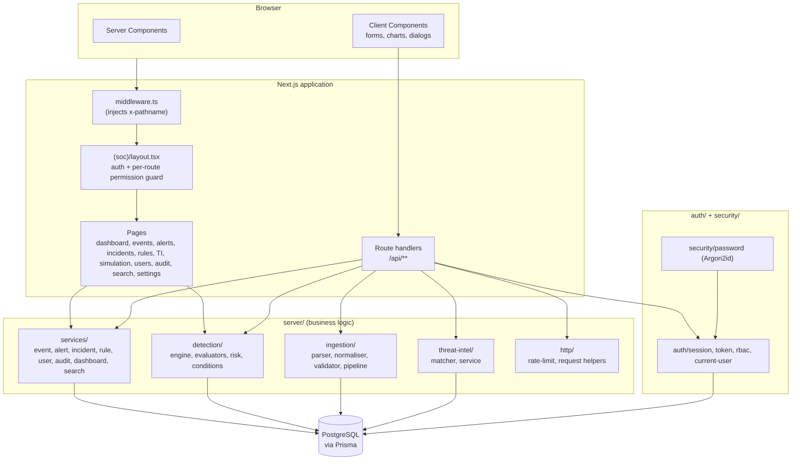
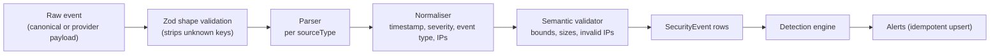
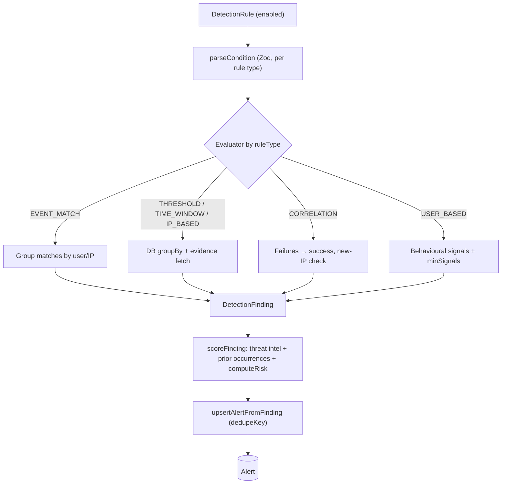
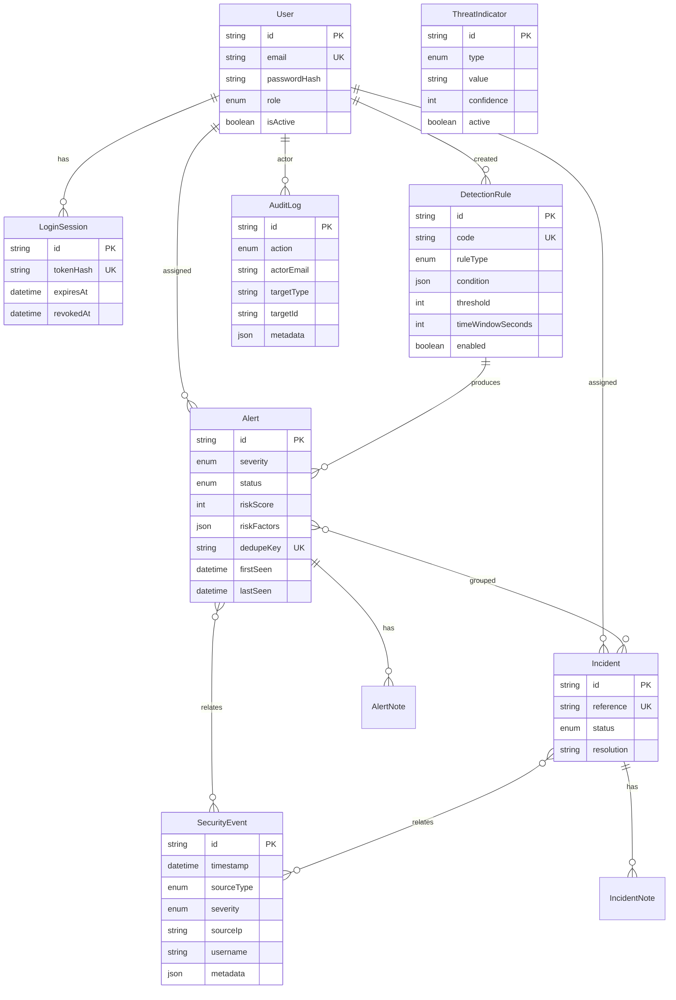
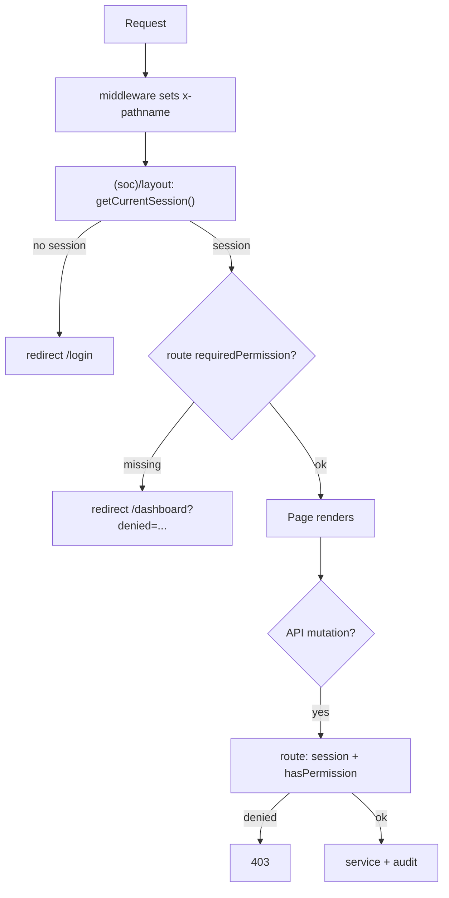
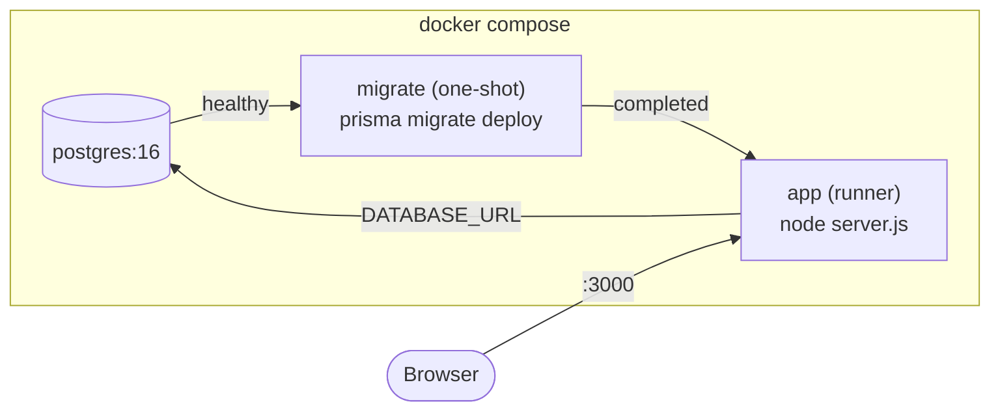

# Securis — Architecture

This document describes how Securis is put together: the component boundaries,
the data flow through the platform, and the database relationships.

---

## 1. Component architecture

**Rules of the layering**

- Pages and route handlers are thin: they parse/validate input, check
  authorization, call a service, and render/return the result.
- All database access lives in `server/services/**` (or `server/threat-intel`),
  so indexes and projections are owned in one place.
- `auth/` and `security/` are dependency-light and reused by both HTTP and
  service layers.
- Nothing in `components/**` imports Prisma or reads secrets.

---

## 2. Event ingestion data flow

Failure handling: per-event failures are reported by index (the batch does not
fail), and a single audit entry summarises each ingestion request.

---

## 3. Detection and scoring flow

The dedupe key `ruleCode:groupValue:windowBucket` is what makes repeated runs
idempotent while still allowing a new alert when the same behaviour recurs in a
later window.

---

## 4. Database relationships

Referential actions: notes and sessions cascade with their parent; assignees and
rule references use `SetNull` so history survives a deletion.

---

## 5. Authorization flow

Authorization is enforced on the server at both the layout (before streaming) and
every API route. The UI only hides controls; it is never the boundary.

---

## 6. Deployment topology

In production the same image runs against a managed PostgreSQL (e.g. Neon) by
changing only `DATABASE_URL` / `DOCKER_DATABASE_URL`.
